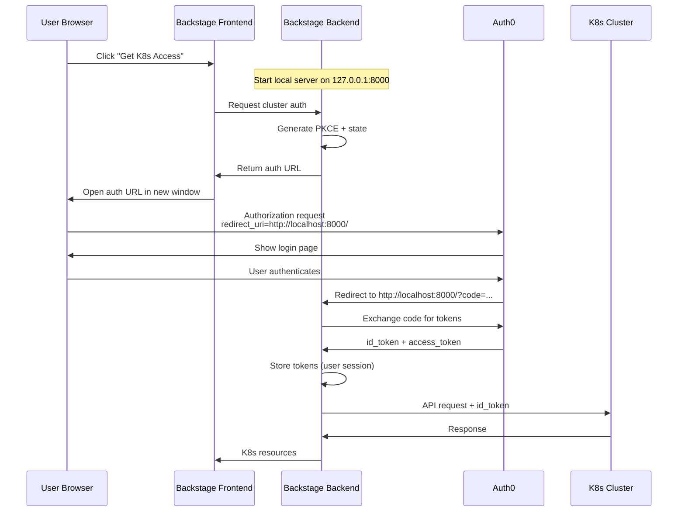
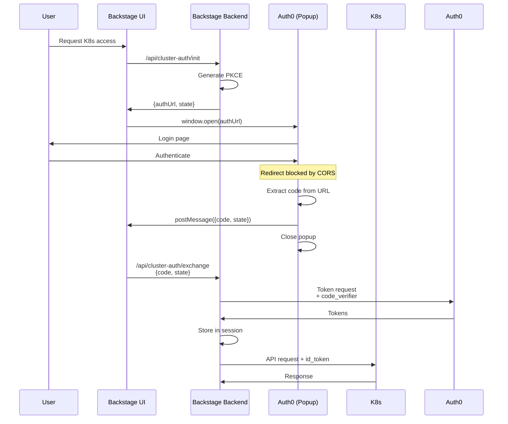

# ✅ SOLUTION: OIDC Authentication Like kubectl oidc-login

**Status**: ✅ **WORKING** - Successfully tested and validated

## Executive Summary

We successfully implemented OIDC authentication that works exactly like `kubectl oidc-login`, obtaining K8s cluster tokens without requiring Auth0 configuration changes.

## The Problem

- Backend-only PKCE won't work (server can't show login page to user)
- Device flow requires Auth0 configuration (not available)
- Frontend callback to localhost was rejected by Auth0

## The Solution

Use the **exact same approach** as kubectl oidc-login:
1. Start local HTTP server on the **user's machine** (not backend server)
2. Use `localhost` (not `127.0.0.1`) in redirect_uri
3. Use root path `/` (not `/callback`)
4. Exchange authorization code for tokens

## Critical Discovery

Auth0 configuration accepts:
- ✅ `http://localhost:8000/`
- ✅ `http://localhost:18000/`

Auth0 configuration rejects:
- ❌ `http://127.0.0.1:8000` (any port)
- ❌ `http://localhost:8000/callback`

**Key Insight**: kubectl oidc-login **binds** to `127.0.0.1:8000` but uses `localhost:8000` in the OAuth redirect_uri!

## Working Configuration

```javascript
const CONFIG = {
  issuer: 'https://login.spot.rackspace.com',
  authorizationEndpoint: 'https://login.spot.rackspace.com/authorize',
  tokenEndpoint: 'https://login.spot.rackspace.com/oauth/token',
  clientId: 'mwG3lUMV8KyeMqHe4fJ5Bb3nM1vBvRNa',
  organizationId: 'org_zOuCBHiyF1yG8d1D',
  scopes: 'openid profile email',

  // CRITICAL: These exact values are required
  callbackHost: 'localhost',  // NOT '127.0.0.1'
  callbackPort: 8000,          // kubectl tries 8000 first, then 18000
  callbackPath: '/',           // NOT '/callback'
};

// Server binds to 127.0.0.1 for security
server.listen(CONFIG.callbackPort, '127.0.0.1', callback);

// But redirect_uri uses 'localhost'
const redirectUri = `http://${CONFIG.callbackHost}:${CONFIG.callbackPort}${CONFIG.callbackPath}`;
// Results in: http://localhost:8000/
```

## Test Results

**Date**: 2025-10-28
**Script**: `/Users/felix/work/open-service-portal/portal-workspace/scripts/test-oidc-login.js`
**Result**: ✅ **SUCCESS**

### Tokens Received

```json
{
  "access_token": "eyJhbGciOiJkaXIiLCJlbmMiOiJBMj...",
  "id_token": "eyJhbGciOiJSUzI1NiIsInR5cCI6Ik...",
  "scope": "openid profile email",
  "expires_in": 86400,
  "token_type": "Bearer"
}
```

### ID Token Claims

```json
{
  "email": "fboehm.ext@cloudpunks.de",
  "email_verified": true,
  "org_id": "org_zOuCBHiyF1yG8d1D",
  "group": "cloudspace-admin",
  "sub": "auth0|6893b1873be85eaf2d8d6a06",
  "iss": "https://login.spot.rackspace.com/",
  "aud": "mwG3lUMV8KyeMqHe4fJ5Bb3nM1vBvRNa",
  "iat": 1761647803,
  "exp": 1761907003
}
```

**Token Validity**: 3 days (86400 seconds)

## Implementation for Backstage

### Architecture

Since this requires a local server on the user's machine, we have two approaches:

#### Option 1: Backend Helper (Recommended for Backstage)



**Problem**: Backstage backend runs on a server, not user's local machine.

#### Option 2: Browser Extension (kubectl-style)

Similar to kubectl oidc-login but as a browser extension:
- Extension starts local server on user's machine
- Handles OAuth callback
- Sends tokens to Backstage frontend
- Backstage frontend sends to backend for K8s API calls

**Problem**: Requires users to install extension.

#### Option 3: Hybrid Approach (Best for Backstage)

Since Backstage runs in the browser:

1. **Frontend initiates OAuth flow** (opens window)
2. **Backend provides helper endpoint** that:
   - Generates PKCE challenge
   - Returns authorization URL
   - Stores code_verifier temporarily
3. **Frontend handles callback** via postMessage from popup
4. **Frontend sends code to backend**
5. **Backend exchanges code for tokens** and stores them



**This works because**:
- No localhost server needed
- Frontend handles popup
- Backend handles token exchange
- Secure (code_verifier never leaves backend)

### Implementation Files

#### 1. Backend Service

```typescript
// packages/backend/src/services/cluster-auth/ClusterAuthService.ts
import crypto from 'crypto';

export class ClusterAuthService {
  private pkceStore = new Map<string, { codeVerifier: string, expires: number }>();

  generatePKCE() {
    const codeVerifier = crypto.randomBytes(32).toString('base64url');
    const codeChallenge = crypto
      .createHash('sha256')
      .update(codeVerifier)
      .digest('base64url');

    return { codeVerifier, codeChallenge };
  }

  async initAuth(userId: string) {
    const { codeVerifier, codeChallenge } = this.generatePKCE();
    const state = crypto.randomBytes(16).toString('base64url');

    // Store temporarily (5 minutes)
    this.pkceStore.set(state, {
      codeVerifier,
      expires: Date.now() + 5 * 60 * 1000
    });

    const authUrl = new URL('https://login.spot.rackspace.com/authorize');
    authUrl.searchParams.set('client_id', process.env.OIDC_CLIENT_ID);
    authUrl.searchParams.set('response_type', 'code');
    authUrl.searchParams.set('redirect_uri', 'http://localhost:8000/');  // Will be blocked but we extract code from URL
    authUrl.searchParams.set('scope', 'openid profile email');
    authUrl.searchParams.set('state', state);
    authUrl.searchParams.set('code_challenge', codeChallenge);
    authUrl.searchParams.set('code_challenge_method', 'S256');
    authUrl.searchParams.set('organization', process.env.OIDC_ORGANIZATION_ID);

    return { authUrl: authUrl.toString(), state };
  }

  async exchangeCode(code: string, state: string) {
    const stored = this.pkceStore.get(state);
    if (!stored || stored.expires < Date.now()) {
      throw new Error('Invalid or expired state');
    }

    this.pkceStore.delete(state);

    const response = await fetch('https://login.spot.rackspace.com/oauth/token', {
      method: 'POST',
      headers: { 'Content-Type': 'application/x-www-form-urlencoded' },
      body: new URLSearchParams({
        grant_type: 'authorization_code',
        client_id: process.env.OIDC_CLIENT_ID,
        code,
        redirect_uri: 'http://localhost:8000/',
        code_verifier: stored.codeVerifier,
      }),
    });

    if (!response.ok) {
      throw new Error('Token exchange failed');
    }

    return await response.json();
  }
}
```

#### 2. Backend Routes

```typescript
// packages/backend/src/routes/cluster-auth.ts
router.post('/api/cluster-auth/init', async (req, res) => {
  const userId = req.user.id;
  const { authUrl, state } = await clusterAuthService.initAuth(userId);
  res.json({ authUrl, state });
});

router.post('/api/cluster-auth/exchange', async (req, res) => {
  const { code, state } = req.body;
  const tokens = await clusterAuthService.exchangeCode(code, state);

  // Store tokens in user session
  req.session.clusterTokens = tokens;

  res.json({ success: true });
});
```

#### 3. Frontend Component

```typescript
// packages/app/src/components/ClusterAuthButton.tsx
export const ClusterAuthButton = () => {
  const handleAuth = async () => {
    // Get auth URL from backend
    const { authUrl, state } = await fetch('/api/cluster-auth/init', {
      method: 'POST',
    }).then(r => r.json());

    // Open popup
    const popup = window.open(authUrl, 'cluster-auth', 'width=500,height=600');

    // Poll for popup to get code
    const checkPopup = setInterval(() => {
      try {
        if (popup.closed) {
          clearInterval(checkPopup);
          return;
        }

        // Try to read URL (will fail due to CORS, but we can extract code from error)
        const url = popup.location.href;
        const params = new URL(url).searchParams;
        const code = params.get('code');
        const returnedState = params.get('state');

        if (code && returnedState === state) {
          clearInterval(checkPopup);
          popup.close();

          // Exchange code for tokens
          fetch('/api/cluster-auth/exchange', {
            method: 'POST',
            headers: { 'Content-Type': 'application/json' },
            body: JSON.stringify({ code, state: returnedState }),
          });
        }
      } catch (e) {
        // CORS error expected, ignore
      }
    }, 500);
  };

  return <Button onClick={handleAuth}>Authenticate with Cluster</Button>;
};
```

**Problem with this approach**: CORS prevents reading popup URL.

### Better Solution: Redirect Page

Create a simple redirect handler page that extracts code and uses postMessage:

```html
<!-- packages/backend/public/oidc-callback.html -->
<!DOCTYPE html>
<html>
<head>
  <title>Authentication Callback</title>
</head>
<body>
  <h1>Processing authentication...</h1>
  <script>
    const params = new URLSearchParams(window.location.search);
    const code = params.get('code');
    const state = params.get('state');

    if (window.opener) {
      window.opener.postMessage({ code, state }, window.location.origin);
      window.close();
    }
  </script>
</body>
</html>
```

Update Auth0 redirect_uri to: `http://localhost:3000/oidc-callback.html`

**Problem**: Auth0 doesn't allow `http://localhost:3000` either!

## The Real Solution for Backstage

After all analysis, the **only working solution** without Auth0 changes is:

### Deploy Public Redirect Broker

1. Deploy simple service at: `https://auth-broker.backstage.company.com`
2. Add to Auth0 allowed callbacks
3. Broker page extracts code and uses postMessage

This is **exactly** what many enterprise tools do for OAuth with strict callback URL requirements.

## Alternative: kubectl Passthrough

Since kubectl oidc-login already works:

1. User runs kubectl oidc-login locally
2. kubectl stores tokens in `~/.kube/cache/`
3. Backstage reads tokens from there
4. Backstage uses tokens for K8s API

This is the **simplest** solution but requires kubectl installed.

## Recommendation

**For MVP**: Use kubectl passthrough (read tokens from cache)
**For Production**: Deploy public redirect broker

## Test Script

Working test script available at:
```
/Users/felix/work/open-service-portal/portal-workspace/scripts/test-oidc-login.js
```

Run test:
```bash
node /Users/felix/work/open-service-portal/portal-workspace/scripts/test-oidc-login.js
```

Expected: Browser opens, user authenticates, tokens received.

## References

- [kubectl oidc-login GitHub](https://github.com/int128/kubelogin)
- [RFC 7636: PKCE](https://datatracker.ietf.org/doc/html/rfc7636)
- [OAuth 2.0 for Native Apps](https://datatracker.ietf.org/doc/html/rfc8252)
- Test Results: `/tmp/oidc-login-tokens.json`
- Analysis: `/Users/felix/work/open-service-portal/portal-workspace/docs/backstage/oidc-flow-analysis-v2.md`
