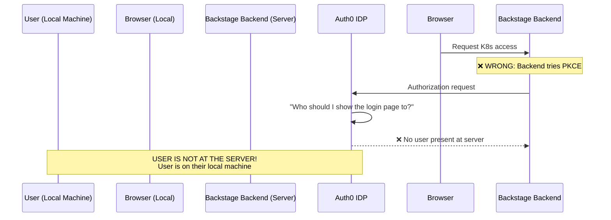
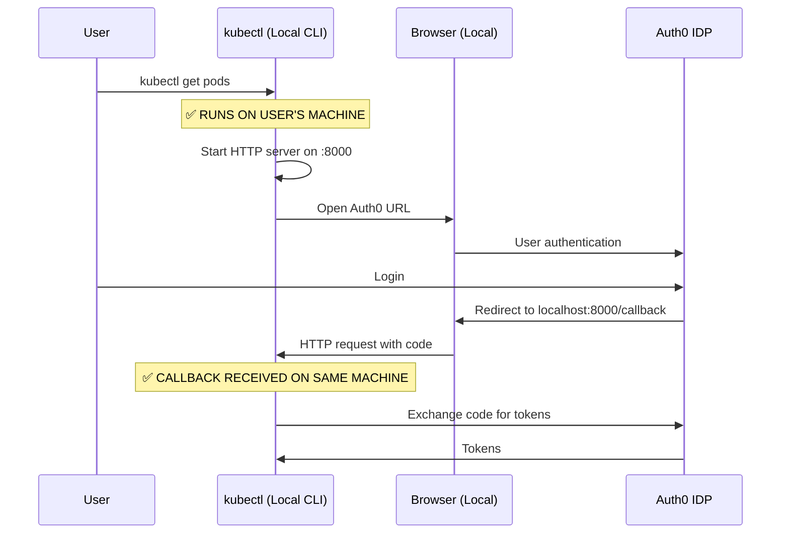
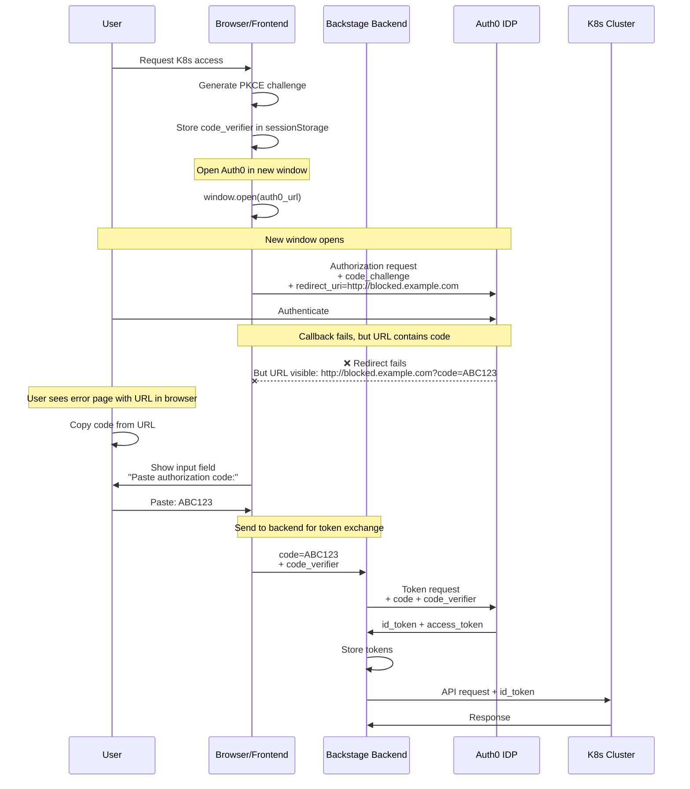
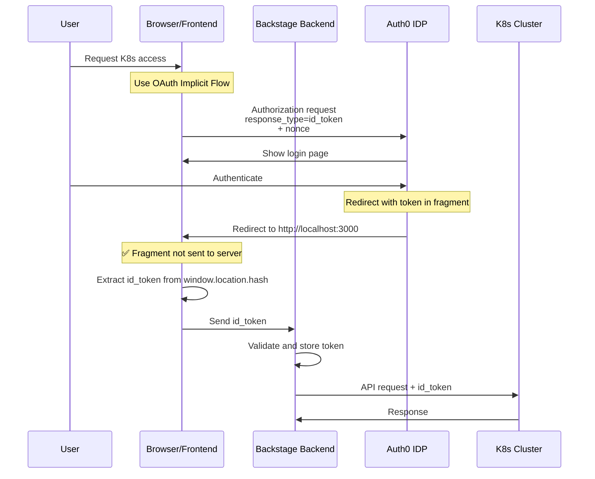
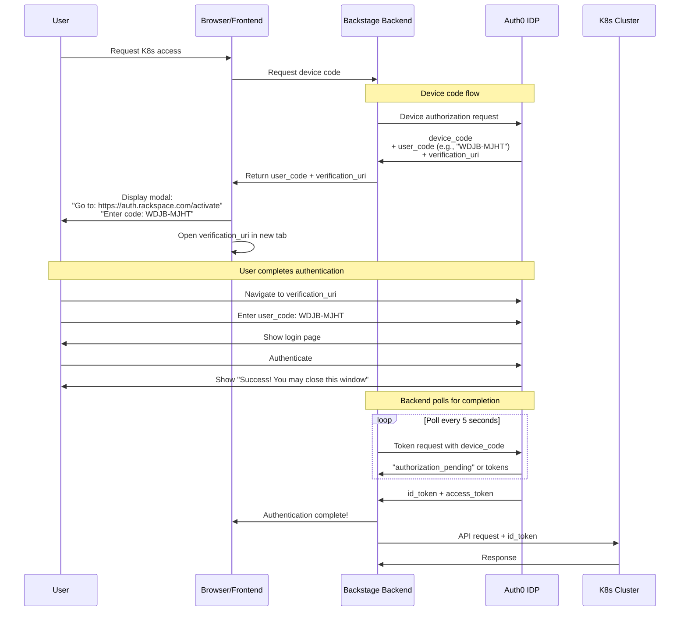
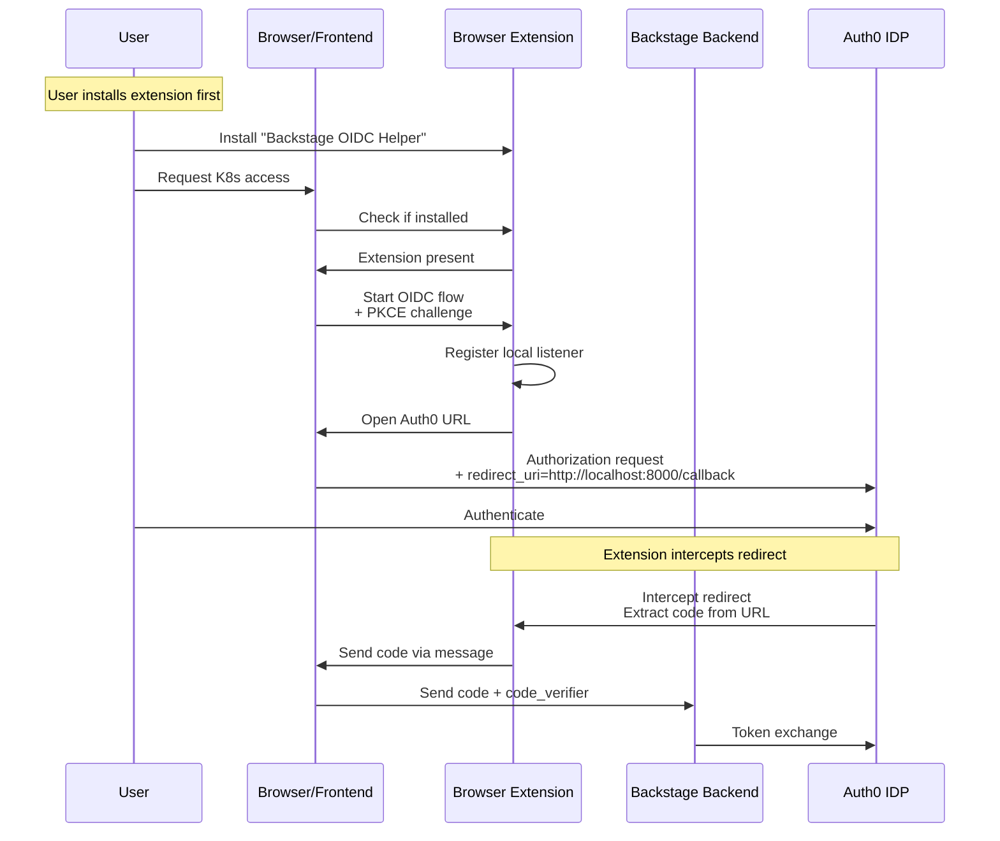

# OIDC Authentication Flow Analysis v2 - Frontend Involvement Required

**Critical Realization**: The backend-only PKCE approach won't work because the backend runs on a server, not on the user's local machine. The user must authenticate in THEIR browser, not the server's.

## The Real Problem

### Why Backend-Only PKCE Fails



**Why this fails:**
- ❌ Backend is on a server (not user's machine)
- ❌ User can't see Auth0 login page on the server
- ❌ Even `prompt=none` requires prior user session with Auth0

### Why kubectl oidc-login Works



**Why this works:**
- ✅ kubectl runs on user's local machine
- ✅ Opens browser on SAME machine
- ✅ Starts local callback server on SAME machine
- ✅ Can receive localhost callback

## Viable Solutions for Backstage

### Solution 1: Frontend-Initiated Flow with Manual Code Entry

The frontend opens Auth0, user copies the authorization code manually.



**Pros:**
- ✅ Works around localhost restriction
- ✅ Frontend handles user interaction
- ✅ Backend handles token exchange securely
- ✅ No server-side OIDC client configuration needed

**Cons:**
- ⚠️ Manual code entry (poor UX)
- ⚠️ User must understand the process
- ⚠️ Code visible in browser history

### Solution 2: Implicit Flow with Fragment (#)

Auth0 returns tokens in URL fragment, no callback server needed.



**Pros:**
- ✅ No localhost callback to backend needed
- ✅ Fragment (#) not sent to server (more secure)
- ✅ Frontend can read window.location.hash
- ✅ Better UX than manual code entry

**Cons:**
- ⚠️ Implicit flow is deprecated (security concerns)
- ⚠️ No refresh tokens
- ⚠️ Token visible in browser history
- ⚠️ Auth0 may have disabled implicit flow

### Solution 3: Device Authorization Grant (Device Code Flow)

User authenticates on Auth0's website using a code.



**Pros:**
- ✅ No localhost callback needed
- ✅ Works around all redirect restrictions
- ✅ Secure (backend handles tokens)
- ✅ Standard OAuth 2.0 flow

**Cons:**
- ⚠️ Requires device flow support in Auth0
- ⚠️ Extra step for user (entering code)
- ⚠️ May not be enabled in Auth0 tenant

### Solution 4: Public Redirect Broker

Use a public URL we control to catch the callback, then communicate with frontend.

```mermaid
sequenceDiagram
    participant User
    participant Browser/Frontend
    participant Backstage Backend
    participant Public Broker (https://broker.example.com)
    participant Auth0 IDP
    participant K8s Cluster

    User->>Browser/Frontend: Request K8s access
    Browser/Frontend->>Browser/Frontend: Generate PKCE + state
    Browser/Frontend->>Browser/Frontend: Store in sessionStorage

    Note over Browser/Frontend: Open Auth0 with public redirect
    Browser/Frontend->>Auth0 IDP: Authorization request<br/>+ code_challenge<br/>+ redirect_uri=https://broker.example.com/callback<br/>+ state=xyz123

    User->>Auth0 IDP: Authenticate

    Auth0 IDP->>Public Broker (https://broker.example.com): Redirect with code<br/>+ state=xyz123

    Note over Public Broker (https://broker.example.com): Minimal broker page
    Public Broker (https://broker.example.com)->>Public Broker (https://broker.example.com): Extract code from URL
    Public Broker (https://broker.example.com)->>Browser/Frontend: postMessage({ code, state })<br/>to window.opener

    Browser/Frontend->>Browser/Frontend: Verify state matches
    Browser/Frontend->>Browser/Frontend: Get code_verifier from sessionStorage

    Browser/Frontend->>Backstage Backend: Send code + code_verifier
    Backstage Backend->>Auth0 IDP: Token exchange
    Auth0 IDP->>Backstage Backend: id_token + access_token

    Backstage Backend->>K8s Cluster: API request + id_token
```

**Pros:**
- ✅ Standard OAuth flow
- ✅ Good UX (automatic)
- ✅ Secure (PKCE + state)
- ✅ Backend handles tokens

**Cons:**
- ⚠️ Requires public broker service
- ⚠️ Need to add broker URL to Auth0 allowed callbacks
- ⚠️ postMessage security considerations

### Solution 5: Browser Extension Helper

A browser extension acts as the local callback server.



**Pros:**
- ✅ Works exactly like kubectl oidc-login
- ✅ No backend callback needed
- ✅ Good UX once installed

**Cons:**
- ❌ Requires users to install extension
- ❌ Maintenance burden
- ❌ Not available on mobile
- ❌ Complex to implement

## Recommended Solution: Device Code Flow (Solution 3)

### Why Device Code Flow?

1. **Works around all restrictions** ✅
   - No localhost callbacks needed
   - No public broker needed
   - No browser extension needed

2. **Secure** ✅
   - Backend handles all tokens
   - No tokens in browser history
   - Standard OAuth 2.0 flow

3. **Good enough UX** ⚠️
   - One-time setup per session
   - Clear instructions
   - Similar to other enterprise tools

4. **Easy to implement** ✅
   - Auth0 supports it
   - Backstage backend already has infrastructure
   - Frontend just shows instructions

### Implementation Plan

#### Step 1: Check Auth0 Configuration

```bash
# Check if device flow is enabled
curl https://login.spot.rackspace.com/.well-known/openid-configuration | jq '.grant_types_supported'

# Should include: "urn:ietf:params:oauth:grant-type:device_code"
```

#### Step 2: Backend Device Flow Service

```typescript
// packages/backend/src/services/cluster-token/DeviceFlowService.ts
export class DeviceFlowService {
  async initiateDeviceFlow(): Promise<DeviceFlowInitiation> {
    const response = await fetch(`${this.issuer}/oauth/device/code`, {
      method: 'POST',
      headers: { 'Content-Type': 'application/x-www-form-urlencoded' },
      body: new URLSearchParams({
        client_id: this.clientId,
        scope: 'openid profile email',
      }),
    });

    const data = await response.json();

    return {
      deviceCode: data.device_code,
      userCode: data.user_code,
      verificationUri: data.verification_uri,
      verificationUriComplete: data.verification_uri_complete,
      expiresIn: data.expires_in,
      interval: data.interval || 5,
    };
  }

  async pollForToken(deviceCode: string): Promise<TokenResponse> {
    // Poll Auth0 every 5 seconds until user completes auth
    while (true) {
      await sleep(this.interval * 1000);

      const response = await fetch(`${this.issuer}/oauth/token`, {
        method: 'POST',
        headers: { 'Content-Type': 'application/x-www-form-urlencoded' },
        body: new URLSearchParams({
          grant_type: 'urn:ietf:params:oauth:grant-type:device_code',
          device_code: deviceCode,
          client_id: this.clientId,
        }),
      });

      if (response.ok) {
        return await response.json();
      }

      const error = await response.json();
      if (error.error === 'authorization_pending') {
        continue; // Keep polling
      }

      throw new Error(error.error_description);
    }
  }
}
```

#### Step 3: Frontend Device Flow UI

```typescript
// packages/app/src/components/ClusterAuthModal.tsx
export const ClusterAuthModal = () => {
  const [authData, setAuthData] = useState<DeviceFlowData | null>(null);

  const startDeviceFlow = async () => {
    const response = await fetch('/api/cluster-auth/device-flow/initiate');
    const data = await response.json();
    setAuthData(data);

    // Open verification URL in new tab
    window.open(data.verificationUriComplete || data.verificationUri);

    // Poll backend for completion
    await pollForCompletion(data.deviceCode);
  };

  return (
    <Dialog open>
      <DialogTitle>Kubernetes Cluster Authentication</DialogTitle>
      <DialogContent>
        {authData ? (
          <>
            <Typography variant="h6">Authentication Required</Typography>
            <Typography>
              1. A new tab has opened to: {authData.verificationUri}
            </Typography>
            <Typography variant="h4" style={{ margin: '20px 0' }}>
              Code: <strong>{authData.userCode}</strong>
            </Typography>
            <Typography>
              2. Enter this code and sign in with your Rackspace credentials
            </Typography>
            <Typography color="textSecondary">
              Waiting for authentication... (expires in {authData.expiresIn}s)
            </Typography>
            <CircularProgress />
          </>
        ) : (
          <>
            <Typography>
              To access Kubernetes cluster resources, you need to authenticate
              with your cluster credentials.
            </Typography>
            <Button onClick={startDeviceFlow}>
              Authenticate with Cluster
            </Button>
          </>
        )}
      </DialogContent>
    </Dialog>
  );
};
```

#### Step 4: Trigger on K8s Resource Access

```typescript
// packages/app/src/components/catalog/EntityPage.tsx
const KubernetesContent = () => {
  const { loading, error, kubernetesObjects } = useKubernetesObjects();

  if (error?.type === 'CLUSTER_AUTH_REQUIRED') {
    return <ClusterAuthModal />;
  }

  return <KubernetesContentDefault />;
};
```

### User Experience Flow

```
1. User clicks on Kubernetes tab
   ↓
2. Modal appears: "Kubernetes Cluster Authentication Required"
   ↓
3. New tab opens to: https://auth.rackspace.com/activate
   ↓
4. User sees: "Enter code: WDJB-MJHT"
   ↓
5. User enters code and signs in with Rackspace credentials
   ↓
6. Auth0 shows: "Success! You may close this window"
   ↓
7. Backstage modal updates: "Authentication successful!"
   ↓
8. Kubernetes resources load automatically
```

## Alternative: If Device Flow Not Available

If Auth0 doesn't support device flow, use **Solution 4 (Public Redirect Broker)**:

1. Deploy simple broker at `https://auth-broker.backstage.example.com`
2. Add to Auth0 allowed callbacks
3. Broker page just does: `window.opener.postMessage({ code, state })`
4. Close itself

## Comparison of Solutions

| Solution | UX | Security | Complexity | Auth0 Config | Works? |
|----------|----|----|----------|--------------|--------|
| 1. Manual Code | ⭐⭐ | ⭐⭐⭐⭐ | ⭐⭐ | None | ✅ Always |
| 2. Implicit Flow | ⭐⭐⭐⭐ | ⭐⭐ | ⭐⭐⭐ | May be disabled | ⚠️ Maybe |
| **3. Device Flow** | **⭐⭐⭐** | **⭐⭐⭐⭐⭐** | **⭐⭐⭐** | **Needs device flow** | **✅ Best** |
| 4. Public Broker | ⭐⭐⭐⭐ | ⭐⭐⭐⭐ | ⭐⭐⭐⭐ | Need broker URL | ✅ Yes |
| 5. Browser Extension | ⭐⭐⭐⭐ | ⭐⭐⭐⭐ | ⭐⭐⭐⭐⭐ | None | ✅ Yes |

## Answering Your Questions

> "Thinking it through, the backend can perform a pkce login only if a browser is logged in for that user on the device that runs the backend, right?"

**Correct!** ✅ That was the fatal flaw in my v1 analysis. The backend cannot show a login page to the user.

> "Could the frontend perform the action to open the rackspace login url and grab the required infos?"

**Yes!** ✅ The frontend MUST be involved because:
1. User is at the frontend (their browser)
2. User must see and interact with Auth0 login page
3. Frontend must somehow capture the result

The question is HOW the frontend grabs the info:
- **Device Flow**: User enters code on Auth0's site, backend polls
- **Public Broker**: Redirect to public URL, postMessage back to frontend
- **Manual**: User copies code from failed redirect URL

## Next Steps

1. **Check Auth0 capabilities**:
   ```bash
   curl https://login.spot.rackspace.com/.well-known/openid-configuration | jq
   ```
   Look for: `"grant_types_supported"` includes `"urn:ietf:params:oauth:grant-type:device_code"`

2. **If device flow supported** → Implement Solution 3 (Device Flow)
3. **If not** → Implement Solution 4 (Public Broker) or Solution 1 (Manual Code Entry)

Would you like me to check the Auth0/Rackspace configuration or start implementing one of these solutions?
