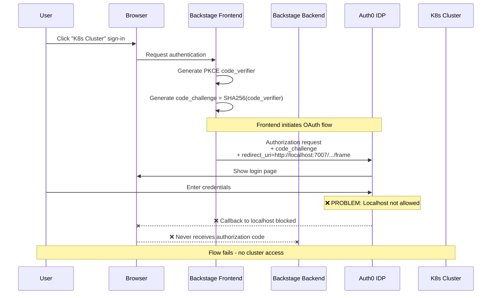
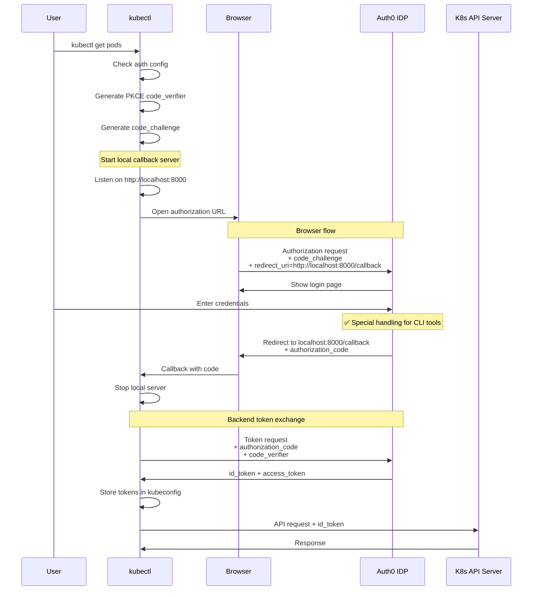
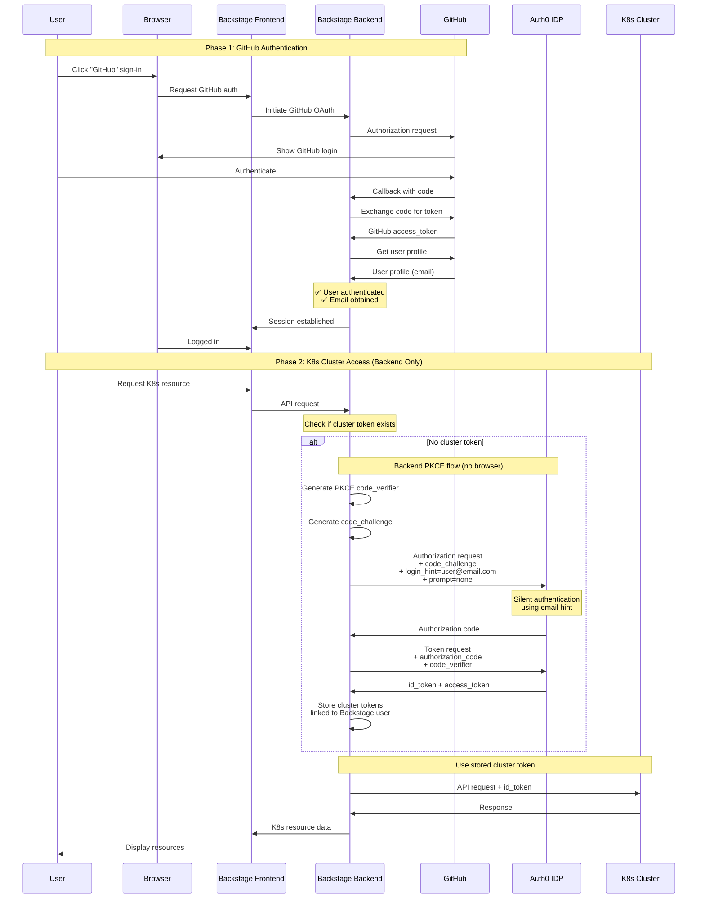
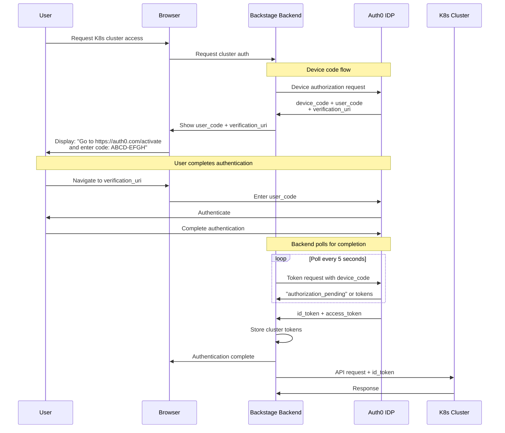
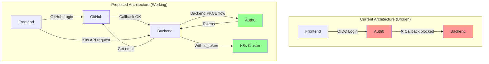

# OIDC Authentication Flow Analysis

This document analyzes the current OIDC authentication implementation and proposes a solution that mimics kubectl oidc-login behavior.

## Problem Statement

The current implementation uses a **frontend OAuth callback flow** that requires Auth0 to redirect back to `http://localhost:7007/api/auth/oidc/handler/frame`. However:
- **Localhost is not allowed** in Auth0's allowed callback domains
- **We cannot add it** to the allowed domains (organizational policy)
- **kubectl oidc-login works** without this issue, suggesting an alternative approach exists

## Current Implementation (Not Working for Localhost)

### Flow 1: Current Backend + Frontend PKCE Flow



**Issues:**
1. ❌ Auth0 blocks localhost callbacks
2. ❌ Frontend cannot receive authorization code
3. ❌ No tokens obtained
4. ❌ User cannot access Kubernetes cluster

## How kubectl oidc-login Works

### Flow 2: kubectl oidc-login (Working Reference)



**Why it works:**
1. ✅ CLI tools get **special OIDC client configuration** in Auth0
2. ✅ Auth0 allows localhost for **native/CLI applications** (not web apps)
3. ✅ kubectl runs a **temporary local server** to receive callback
4. ✅ Token exchange happens **entirely in backend** (kubectl binary)

## Proposed Solution: GitHub → Backend PKCE Flow

### Flow 3: Proposed Backstage Flow (No Frontend OIDC Callback)



**Advantages:**
1. ✅ No frontend callback to localhost needed
2. ✅ Backend handles all OIDC communication with Auth0
3. ✅ Email from GitHub used for Auth0 login hint
4. ✅ Silent authentication possible if session exists
5. ✅ Tokens stored server-side, linked to Backstage session
6. ✅ Works with Auth0 restrictions

## Alternative: Device Code Flow

### Flow 4: OAuth Device Authorization Grant (Alternative)



**When to use:**
- If Auth0 doesn't support silent authentication
- If backend-to-backend flow is not allowed
- Provides better UX than device code flow

## Comparison Table

| Aspect | Current (Broken) | kubectl oidc-login | Proposed (GitHub→Backend) | Device Code Flow |
|--------|------------------|-------------------|---------------------------|------------------|
| **Frontend Callback** | ❌ Required, blocked | ✅ Local server | ✅ Not needed | ✅ Not needed |
| **Localhost Issues** | ❌ Blocked by Auth0 | ✅ Allowed for CLI | ✅ No localhost callback | ✅ No localhost callback |
| **User Experience** | ❌ Login fails | ✅ Opens browser | ✅ Single GitHub login | ⚠️ Manual code entry |
| **Token Storage** | Frontend | CLI binary | Backend (secure) | Backend (secure) |
| **Implementation Complexity** | Simple | N/A (reference) | Medium | Medium |
| **Auth0 Config Required** | Web app | Native app | Machine-to-machine | Device flow enabled |

## Recommended Implementation: Flow 3 (GitHub → Backend PKCE)

### Architecture Changes Needed



### Implementation Steps

1. **Keep GitHub as Primary Auth** ✅ (Already implemented)
   - Users log in with GitHub
   - Backend extracts user email

2. **Add Backend OIDC Service** (New)
   - Service that performs PKCE flow server-side
   - No frontend involvement
   - Stores tokens in backend session store

3. **Create Token Bridge** (New)
   - Link Backstage user → K8s cluster tokens
   - Token refresh logic
   - Expiration handling

4. **Update Kubernetes Plugin** (Modify)
   - Inject cluster id_token from backend
   - Remove frontend OIDC auth requirement

### Code Structure

```
packages/backend/src/
├── auth-providers/
│   ├── oidc-pkce-authenticator.ts    # ✅ Already exists
│   ├── oidc-pkce-module.ts           # ✅ Already exists
│   └── oidc-pkce-resolvers.ts        # ✅ Already exists
├── services/
│   └── cluster-token/                # 🆕 NEW: Backend token service
│       ├── ClusterTokenService.ts    # PKCE flow for cluster access
│       ├── TokenStore.ts             # Server-side token storage
│       └── TokenRefresh.ts           # Automatic token refresh
└── kubernetes/
    └── token-injector.ts             # 🆕 NEW: Inject cluster tokens
```

## Key Differences from Current Implementation

### What We Have (Doesn't Work)
```typescript
// Frontend initiates OIDC login
const oidcAuthApi = OAuth2.create({
  provider: { id: 'oidc', title: 'K8s Cluster' },
  // ❌ This tries to use browser callback to localhost
});
```

### What We Need (Works)
```typescript
// Backend service for cluster token acquisition
class ClusterTokenService {
  async getClusterToken(backstageUser: User): Promise<string> {
    // Use email from GitHub authentication
    const email = backstageUser.profile.email;

    // Backend PKCE flow (no browser callback)
    const { codeVerifier, codeChallenge } = generatePKCE();

    // Direct backend-to-Auth0 communication
    const authCode = await this.auth0Client.authorize({
      loginHint: email,
      prompt: 'none', // Silent auth
      codeChallenge,
    });

    const tokens = await this.auth0Client.exchangeCode(
      authCode,
      codeVerifier
    );

    // Store server-side
    await this.tokenStore.save(backstageUser.id, tokens);

    return tokens.id_token;
  }
}
```

## Auth0 Configuration Comparison

### Current (Web App Client)
```yaml
Client Type: Single Page Application
Allowed Callbacks:
  - https://backstage.company.com/api/auth/oidc/handler/frame
  ❌ Cannot add localhost
```

### Required (Machine-to-Machine Client)
```yaml
Client Type: Machine to Machine
Grant Types:
  - authorization_code
  - refresh_token
Allowed Callbacks: Not applicable (backend only)
✅ No localhost restriction
Token Endpoint Authentication: client_secret_post
```

## Testing the Proposed Flow

### Prerequisites
1. Create new Auth0 Machine-to-Machine application
2. Configure for authorization_code + PKCE
3. Add email scope
4. Note client_id and client_secret

### Test Steps
```bash
# 1. Login with GitHub (existing)
curl http://localhost:3000/
# Click GitHub → Authenticate → Get session cookie

# 2. Request K8s resource (triggers backend PKCE)
curl -b session.cookie http://localhost:7007/api/kubernetes/pods

# Expected: Backend performs PKCE flow automatically
# Returns K8s pods without frontend OIDC login
```

## Next Steps

1. **Document Current Auth0 Configuration**
   - Export current OIDC client settings
   - Check if machine-to-machine is possible

2. **Prototype Backend Token Service**
   - Implement `ClusterTokenService`
   - Test backend PKCE flow in isolation

3. **Remove Frontend OIDC Auth**
   - Remove oidcAuthApi from frontend
   - Remove K8s Cluster from sign-in page
   - Keep GitHub as only auth method

4. **Integrate with Kubernetes Plugin**
   - Modify `@backstage/plugin-kubernetes-backend`
   - Inject cluster tokens from backend service

5. **Test End-to-End**
   - GitHub login → K8s API access
   - Token refresh
   - Session expiration handling

## Questions to Resolve

1. **Does Auth0 support silent authentication (`prompt=none`)?**
   - Check Auth0 tenant settings
   - May need user consent first-time

2. **Can we create a Machine-to-Machine client?**
   - Check Auth0 plan/tier limits
   - May need approval from Auth0 admin

3. **How does kubectl oidc-login get around localhost?**
   - Check if kubectl uses special Auth0 client
   - May be using device flow instead of auth code flow

4. **Token Storage Strategy**
   - Use Backstage session store?
   - Separate Redis/database?
   - Encryption at rest?

## References

- [RFC 7636: PKCE](https://datatracker.ietf.org/doc/html/rfc7636)
- [RFC 8628: Device Authorization Grant](https://datatracker.ietf.org/doc/html/rfc8628)
- [kubectl OIDC Authentication](https://kubernetes.io/docs/reference/access-authn-authz/authentication/#openid-connect-tokens)
- [Auth0 Machine-to-Machine Apps](https://auth0.com/docs/get-started/applications/application-types#machine-to-machine-applications)
